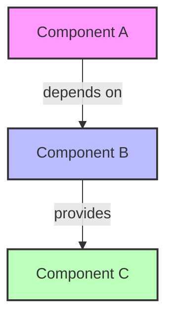
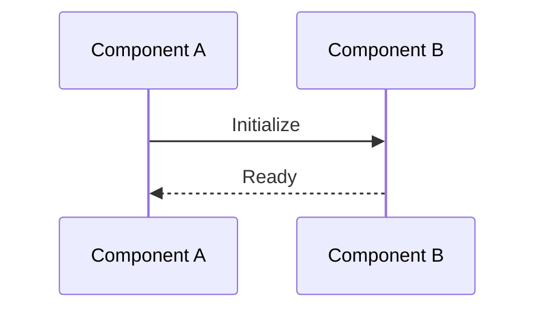
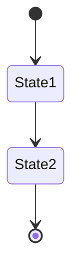
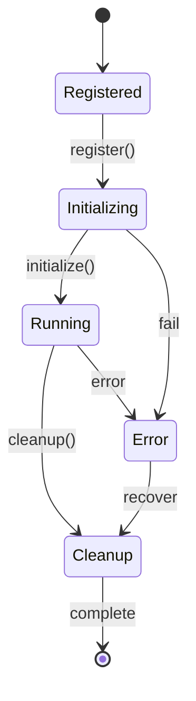
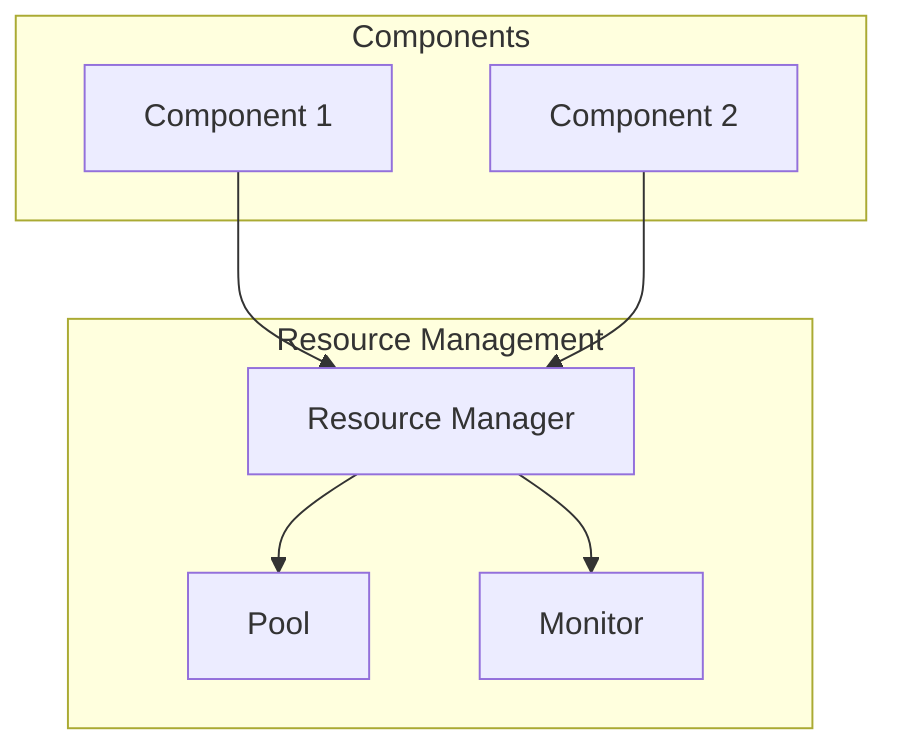
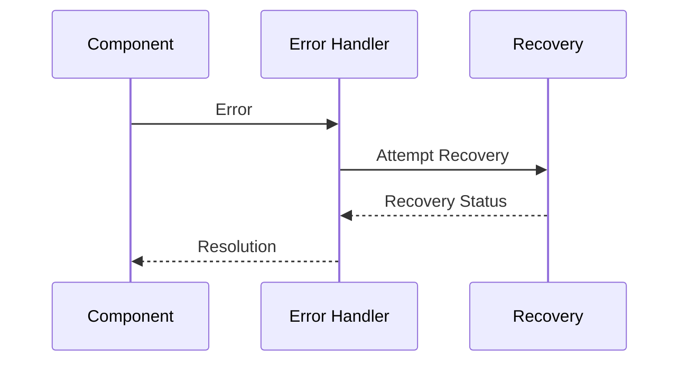

# System Diagrams

## Overview

This directory contains system diagrams that visualize the Tenire Framework's architecture. The diagrams are created using Mermaid.js and can be viewed directly in GitHub or any Markdown viewer that supports Mermaid.

## Diagram Types

### 1. Component Relationships


Legend:
- Pink: Core components
- Blue: Service components
- Green: Utility components
- Arrows: Dependencies/relationships

### 2. Initialization Flow


Legend:
- Solid arrows: Synchronous calls
- Dashed arrows: Asynchronous calls
- Participants: System components

### 3. State Diagrams


Legend:
- [*]: Start/End states
- Boxes: Component states
- Arrows: State transitions

## Reading the Diagrams

### Component Diagrams
1. Start from core components (pink)
2. Follow dependency arrows
3. Note component types by color
4. Understand provided services

### Flow Diagrams
1. Read from top to bottom
2. Note synchronous vs async calls
3. Understand component interactions
4. Follow error paths

### State Diagrams
1. Start from initial state
2. Follow possible transitions
3. Note terminal states
4. Understand error states

## Maintaining Diagrams

### Adding New Components
1. Use consistent color scheme
2. Follow naming conventions
3. Update all affected diagrams
4. Document new relationships

### Updating Relationships
1. Maintain diagram consistency
2. Update dependent diagrams
3. Document changes
4. Verify accuracy

### Style Guide

#### Colors
```
Core Components: #f9f
Service Components: #bbf
Utility Components: #bfb
Error States: #fbb
```

#### Arrow Types
```
Dependency: -->
Event Flow: ->>
State Change: -->
Error Path: -.->
```

#### Component Naming
```
CoreComponents: [Name]Manager
Services: [Name]Service
Utilities: [Name]Util
```

## Diagram Categories

### 1. Architecture Overview
- System-wide component relationships
- Core system architecture
- Subsystem organization

### 2. Component Interactions
- Detailed component dependencies
- Service interactions
- Resource flow

### 3. Process Flows
- Initialization sequences
- Error handling paths
- Cleanup procedures

### 4. State Management
- Component lifecycles
- System states
- Error states

## Tools and Resources

### Mermaid.js
- [Official Documentation](https://mermaid-js.github.io/)
- [Live Editor](https://mermaid.live/)
- [GitHub Support](https://docs.github.com/en/get-started/writing-on-github/working-with-advanced-formatting/creating-diagrams)

### Best Practices
1. Keep diagrams focused
2. Use consistent styling
3. Document changes
4. Maintain readability

### Updating Diagrams
1. Use the Mermaid live editor
2. Test changes locally
3. Update documentation
4. Review for accuracy

## Example Diagrams

### Component Lifecycle


### Resource Flow


### Error Handling
