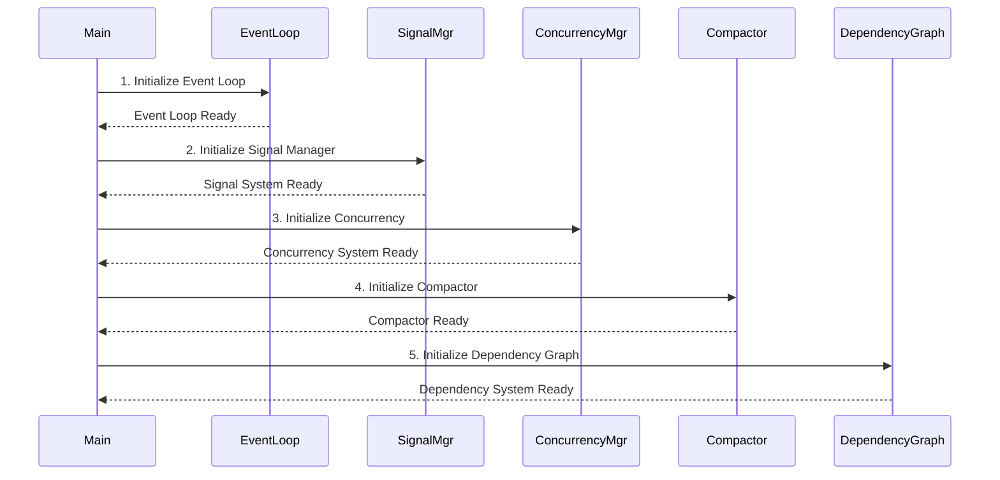
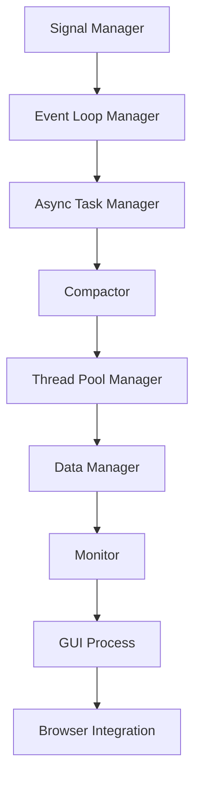
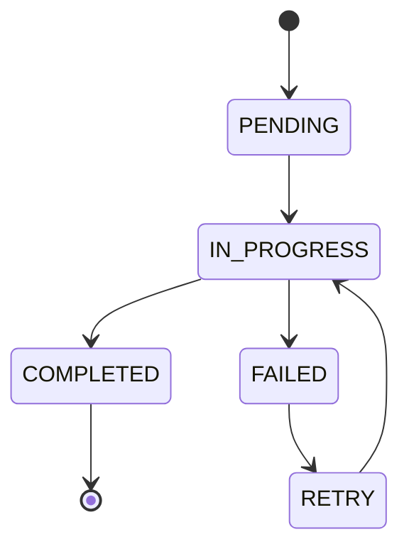
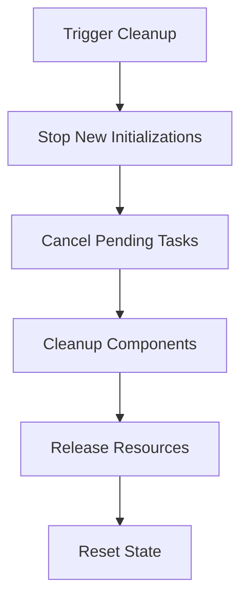

# Initialization Flow

## Overview

The Tenire Framework follows a carefully orchestrated initialization sequence to ensure components are started in the correct order with proper dependency management. This document details the initialization flow from system startup to full operation.

## Core Initialization Sequence



## Detailed Initialization Steps

### 1. Event Loop Initialization
```python
# In main.py
async def initialize_core_components():
    # Initialize event loop first
    if not await event_loop_manager.ensure_initialized():
        return False
```

Key steps:
1. Create or get event loop
2. Configure loop settings
3. Start loop if not running
4. Register Qt integration if needed

### 2. Signal Manager Initialization
- No dependencies required
- Highest priority (1000)
- Critical system component
- Handles system-wide messaging

### 3. Component Registration Order



### 4. Batch Initialization Groups

Components are initialized in optimized batches:

1. **Critical Core Components**
   ```python
   core_order = [
       'signal_manager',      # No dependencies
       'event_loop_manager',  # No dependencies
       'async_task_manager',  # Depends on event_loop_manager
       'compactor',          # Depends on signal_manager
       'thread_pool_manager' # Depends on async_task_manager
   ]
   ```

2. **Data and Storage Components**
   - Data manager
   - Cache systems
   - Storage handlers

3. **Service Components**
   - Monitors
   - Health checks
   - System services

4. **UI Components**
   - GUI process
   - Browser integration
   - UI handlers

## Component States During Initialization



## Initialization Checks and Validations

### Pre-initialization Checks
1. Configuration validation
2. System requirements check
3. Resource availability check

### Post-initialization Checks
1. Component health status
2. Dependency satisfaction
3. Resource allocation
4. System stability

## Error Handling During Initialization

### Retry Mechanism
```python
@dataclass
class InitializationTask:
    timeout: float = 30.0
    retry_count: int = 3
    retry_delay: float = 1.0
```

### Error Recovery Steps
1. Component isolation
2. Dependency rechecking
3. Resource cleanup
4. Retry with backoff

## Cleanup and Recovery

### Cleanup Process


### Resource Management
- Memory cleanup
- Thread pool shutdown
- Event loop cleanup
- File handle closure

## Special Cases

### GUI Process Initialization
```python
# Special handling for GUI components
if task.component == 'gui_process':
    task.dependencies.update({
        'signal_manager',
        'event_loop_manager',
        'async_task_manager',
        'compactor',
        'thread_pool_manager'
    })
    task.metadata['requires_main_thread'] = True
```

### Browser Integration
```python
# Browser component initialization
await component_scheduler.schedule_component(
    InitializationTask(
        component="browser_integration",
        dependencies={
            "gui_process",
            "signal_manager",
            "event_loop_manager"
        },
        priority=65
    )
)
```

## Monitoring and Debugging

### Health Checks
- Component status monitoring
- Resource usage tracking
- Performance metrics
- Error rate monitoring

### Debugging Tools
1. Initialization logging
2. Component state tracking
3. Dependency visualization
4. Performance profiling

## Best Practices

1. **Component Registration**
   - Register core components first
   - Declare all dependencies explicitly
   - Set appropriate priorities
   - Include health checks

2. **Dependency Management**
   - Minimize dependencies
   - Avoid circular dependencies
   - Use proper abstraction
   - Handle optional dependencies

3. **Error Handling**
   - Implement retry logic
   - Provide fallback options
   - Log initialization steps
   - Monitor component health

4. **Resource Management**
   - Clean up resources properly
   - Monitor resource usage
   - Implement timeout handling
   - Use resource pooling 