# Component Relationships

## System Architecture Overview

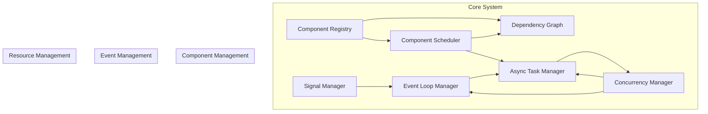

## Core Component Relationships

### Event Loop Manager Dependencies
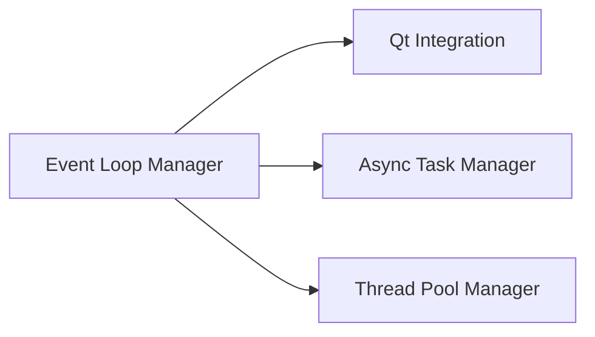

### Component Registry Dependencies
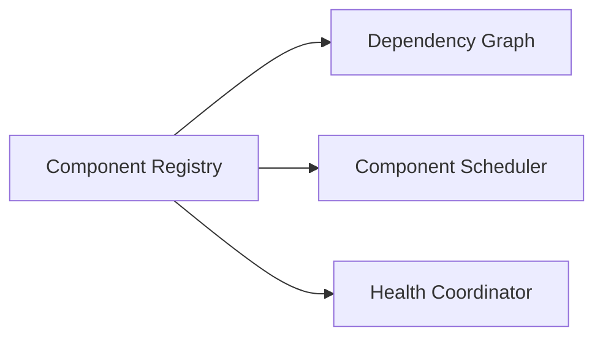

### Scheduler Dependencies
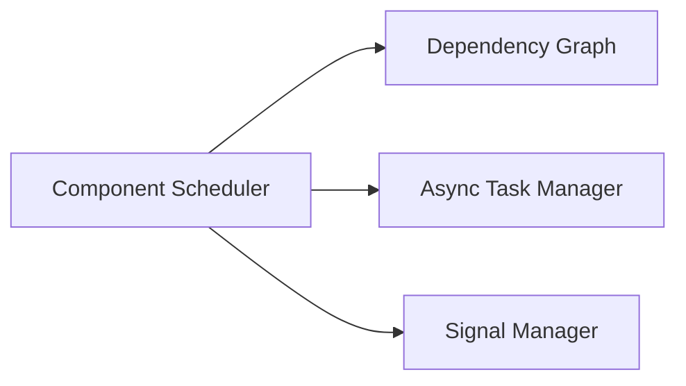

## Component Type Relationships

### Core Components
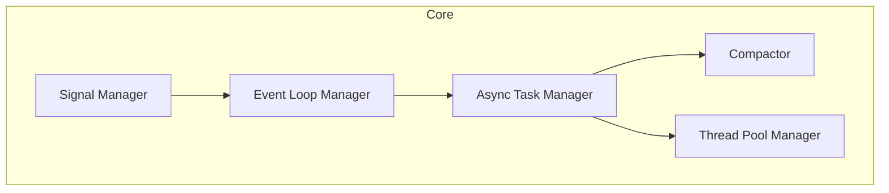

### Data Components
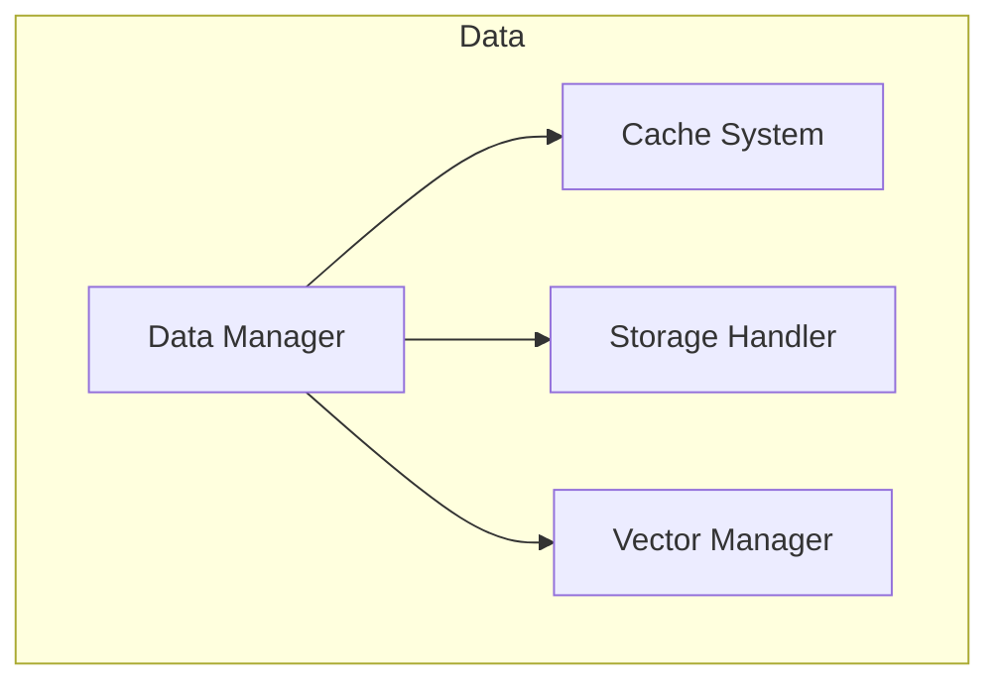

### GUI Components
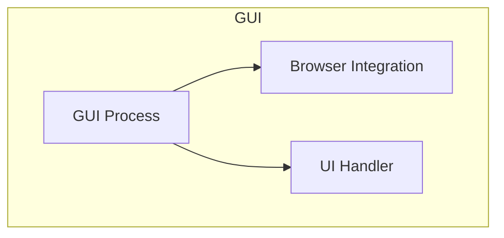

## Initialization Dependencies

### Core Initialization Chain
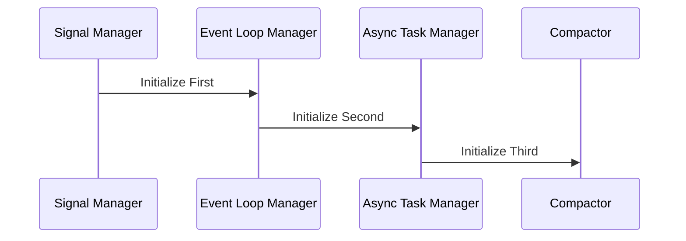

## Resource Management

### Thread Pool Management
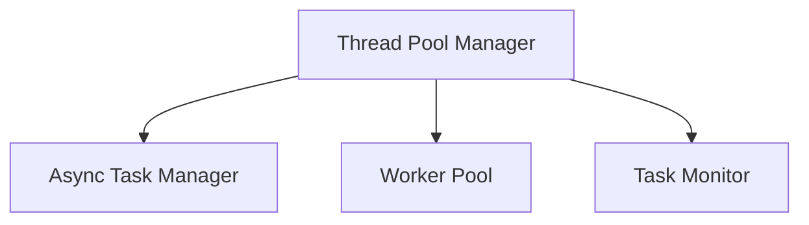

### Memory Management
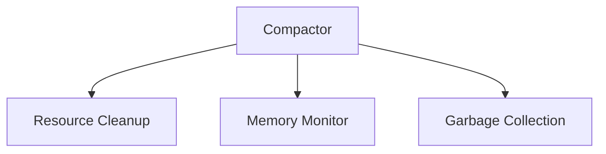

## Health Monitoring Relationships

### Health Check System
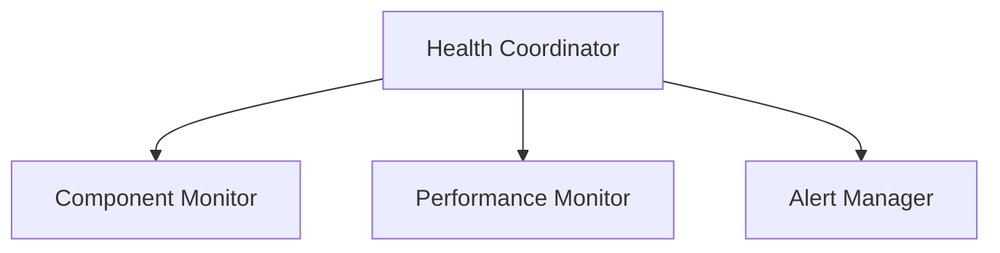

## Signal Flow

### Signal Management System
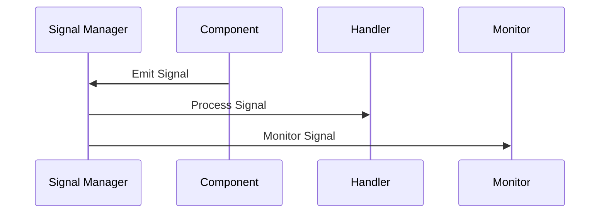

## Component Lifecycle Management

### Lifecycle States
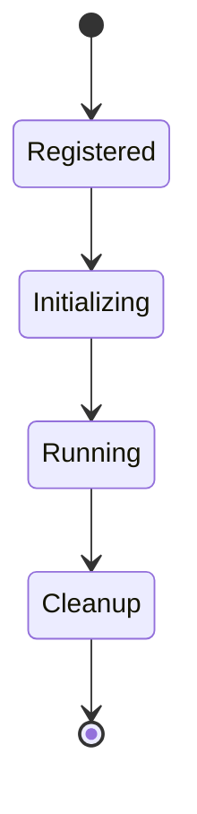

## Error Handling Relationships

### Error Management Flow
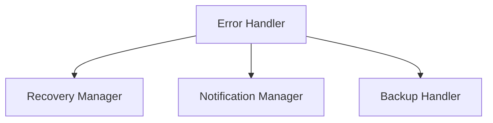

## Key Interactions

1. **Event Loop Management**
   - Event loop creation and management
   - Qt integration handling
   - Thread safety coordination

2. **Component Management**
   - Registration and tracking
   - Dependency resolution
   - Lifecycle management

3. **Resource Management**
   - Thread pool coordination
   - Memory management
   - Resource cleanup

4. **Health Monitoring**
   - Component health tracking
   - Performance monitoring
   - Error detection

## Best Practices for Component Interaction

1. **Dependency Declaration**
   ```python
   @dataclass
   class ComponentMetadata:
       dependencies: Set[str]  # Explicit dependencies
       provides: List[str]     # Provided services
       is_critical: bool       # Critical component flag
   ```

2. **Signal Handling**
   ```python
   async def handle_signal(signal: Signal):
       # Proper signal handling
       if signal.type == SignalType.COMPONENT_STATE:
           await update_component_state(signal.data)
   ```

3. **Resource Management**
   ```python
   async def cleanup_resources():
       # Proper resource cleanup
       await release_threads()
       await close_connections()
       await clear_caches()
   ```

4. **Error Handling**
   ```python
   async def handle_component_error(error: Exception):
       # Proper error handling
       await isolate_component()
       await notify_health_system()
       await attempt_recovery()
   ```

## Component Communication Guidelines

1. **Use Signals for Events**
   - State changes
   - Error notifications
   - Health updates

2. **Use Direct Calls for**
   - Initialization
   - Cleanup
   - Resource management

3. **Use Async Tasks for**
   - Long-running operations
   - Background processing
   - Resource-intensive tasks

4. **Use Health Checks for**
   - Component status
   - Resource usage
   - Performance metrics 