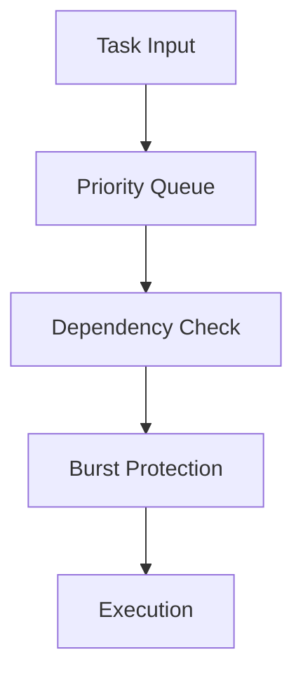
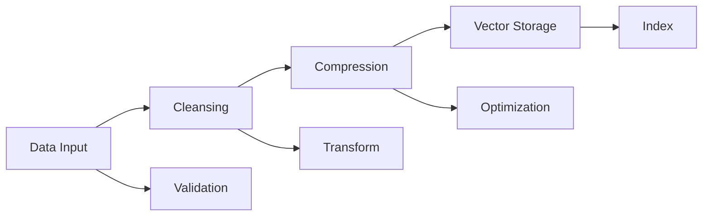
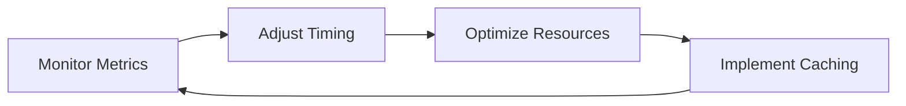

# Tenire Concurrency Architecture

## Overview 🔄

Tenire implements a sophisticated concurrency management system optimized for running multiple concurrent pipelines on consumer hardware. The architecture efficiently orchestrates:

- Data management operations
- Asynchronous GPT API calls
- Compression and data cleansing
- Vector storage operations

## Core Components 🏗️

### Event Loop Management

The `EventLoopManager` forms the backbone of our concurrency system, providing:

✨ **Thread Safety**
- Secure event loop access across processes
- Automatic cleanup of closed loops and orphaned tasks
- Context managers for safe loop lifecycle management

🔗 **Integration**
- Specialized Qt event loop integration for GUI operations
- Optimized task tracking and monitoring

### Universal Timer ⏰

Our monotonic timer implementation ensures precise timing coordination:

```python
class UniversalTimer:
    """Coordinates timing across all concurrency handlers with:
    - Memory-efficient timer registration using weak references
    - Thread-safe timing operations
    - Automatic cleanup of expired timers
    - Interval-based timing coordination
    """
```

### Orchestration Layer 🎭

The `Orchestrator` class delivers sophisticated scheduling and timing control through:

| Feature | Description |
|---------|-------------|
| Adaptive Timing | Dynamic adjustments based on system load |
| Resource Allocation | Priority-based distribution of resources |
| Burst Handling | Intelligent cooldown periods |
| Health Awareness | Real-time scheduling adjustments |

### Batch Processing 📦

The `BatchInitializationGroup` manages concurrent operations via:

1. Priority-based execution queues
2. Smart dependency resolution
3. Configurable concurrency limits
4. Concurrent component initialization

## Key Features 🌟

### 1. Adaptive Resource Management

The system dynamically optimizes based on:

- Real-time system load metrics
- Component priority levels
- Historical performance data
- Burst patterns and cooldown requirements

### 2. Sophisticated Task Scheduling

Our multi-layered scheduling approach includes:



### 3. Memory Optimization 💾

We implement advanced memory management through:

- Weak references for callback management
- Automatic task cleanup
- Resource compaction during idle periods
- Efficient task batching strategies

### 4. Error Resilience 🛡️

Built-in protection mechanisms include:

✅ Automatic task recovery
✅ Graceful degradation under load
✅ Circuit breaker patterns
✅ Health monitoring and self-healing

## Pipeline Management 🔄

### Data Processing Pipeline



### API Integration Pipeline

Our API handling system provides:

| Feature | Benefit |
|---------|----------|
| Rate Limiting | Prevents API quota exhaustion |
| Request Batching | Optimizes throughput |
| Response Caching | Reduces API calls |
| Failure Recovery | Ensures reliability |

## Implementation Details 🛠️

### Core Architecture

The `ConcurrencyManager` implements a sophisticated facade pattern:

```python
class ConcurrencyManager:
    """
    Central hub for concurrency management.
    
    Features:
    - Thread-safe initialization
    - Component lifecycle management
    - Resource optimization
    - Error handling and recovery
    """
    def __init__(self):
        self._initialized = False
        self._initialization_lock = asyncio.Lock()
        self._initialization_complete = asyncio.Event()
        
        # Core Components
        self.thread_pool = ThreadPoolManager()
        self.async_tasks = AsyncTaskManager()
        self.data_manager = DataManager()
```

### Integration Patterns 🔌

The system implements sophisticated integration patterns for:

- Event loop management and synchronization
- Signal system coordination
- Process and thread management
- Browser session control
- GUI process lifecycle management

## Best Practices 📚

### 1. Resource Management

| Practice | Implementation |
|----------|---------------|
| Cleanup | Use context managers |
| Errors | Implement proper handling |
| Monitoring | Track system health |
| Resources | Prompt cleanup |

### 2. Task Scheduling

✅ Critical task prioritization
✅ Operation batching
✅ Dependency management
✅ Error recovery implementation

### 3. Performance Optimization



## Advanced Features 🚀

### Asynchronous GUI Integration

The framework provides seamless GUI integration through:

- Qt event loop integration with async/await support
- Non-blocking UI updates via dedicated event loops
- Thread-safe signal handling
- Efficient state synchronization
- Window and process lifecycle management

### ML Model Operations

The system efficiently manages concurrent ML operations including:

- Model inference and training
- Data preprocessing and vectorization
- Batch prediction handling
- Resource-aware scaling
- Error handling and recovery

## Conclusion 🎯

The Tenire concurrency system represents a state-of-the-art approach to managing complex concurrent operations. Key achievements include:

✨ **Performance**
- Optimized resource utilization
- Efficient task scheduling
- Smart memory management

🛡️ **Reliability**
- Robust error handling
- Graceful degradation
- Self-healing capabilities

🔄 **Flexibility**
- Adaptive resource management
- Dynamic scaling
- Modular architecture

For more information, please refer to our [API documentation](../api/concurrency.md) or [contribution guidelines](../contributing.md). 